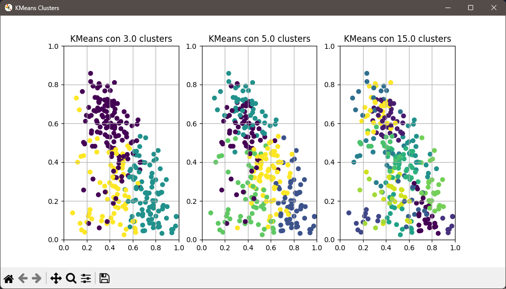
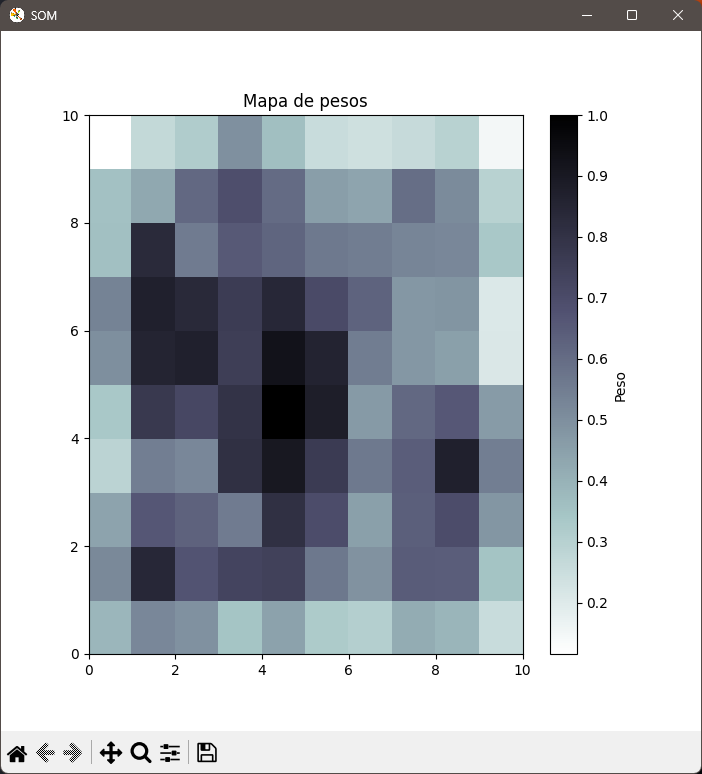

# Modelos de aprendizaje automático no supervisado

Los modelos de aprendizaje automático no supervisado son aquellos que no requieren etiquetas en los datos de entrenamiento. Estos modelos buscan patrones y estructuras en los datos sin la necesidad de supervisión externa. 

Los modelos aplicados son:
- [K-means](/kmeans.py)
- [Redes de kohonen](/kohonen.py). También conocidas como mapas auto-organizados (SOM)

    
    

